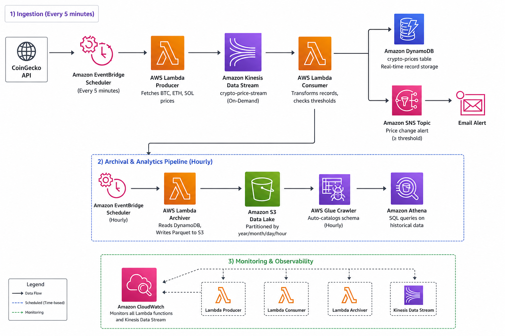
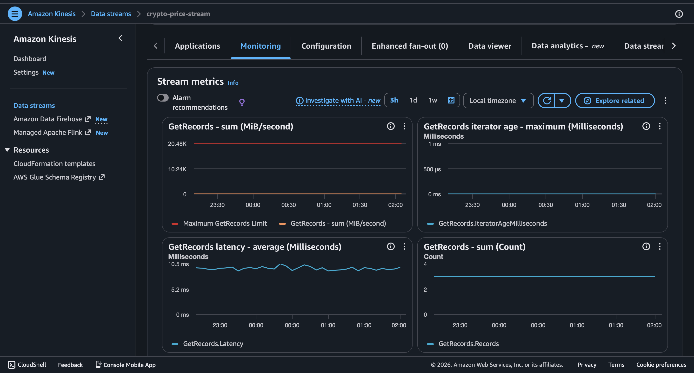
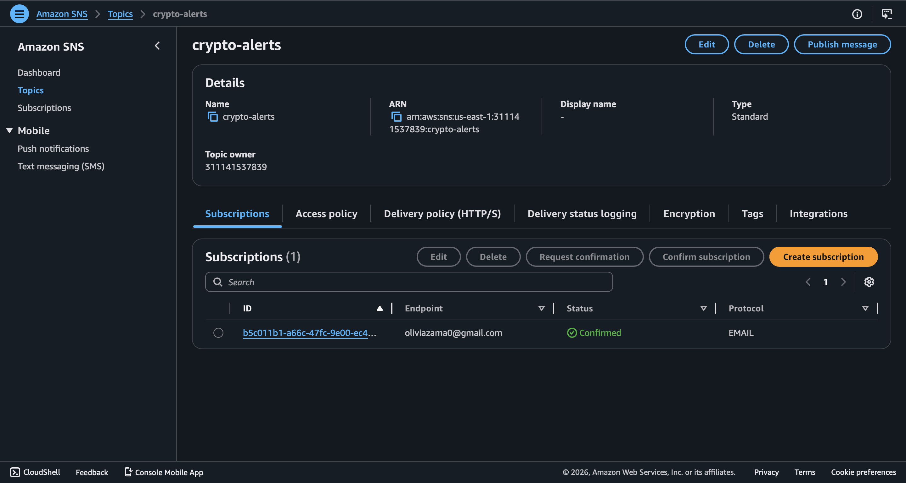
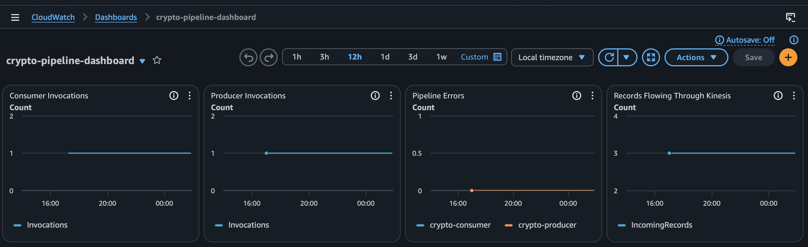
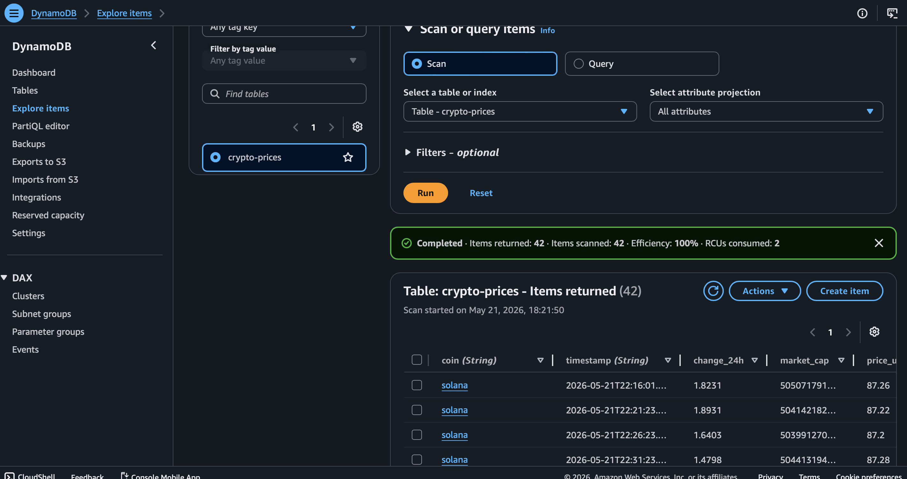
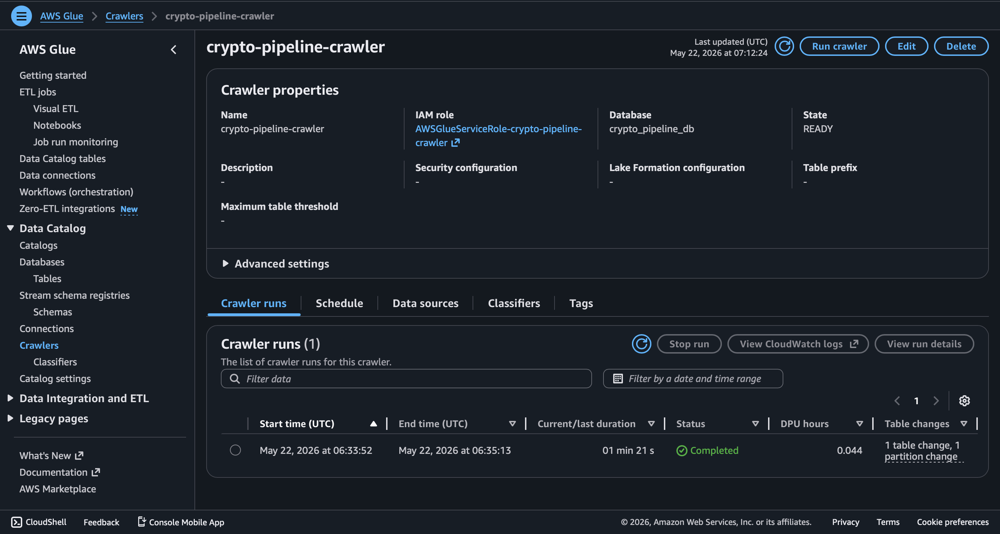
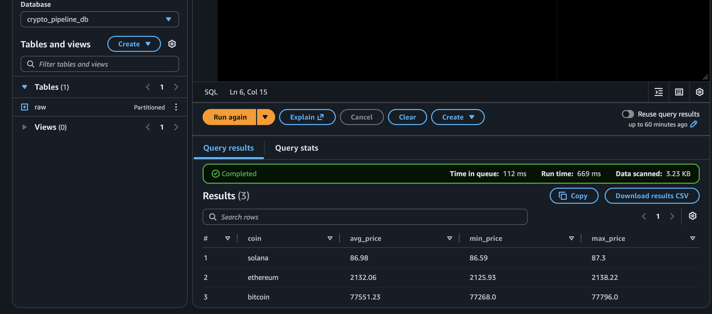

# Real-Time Crypto Price Streaming Pipeline

An event-driven, serverless data pipeline that streams live cryptocurrency prices from the CoinGecko API into AWS, detects anomalies, and triggers real-time email alerts — deployed as Infrastructure as Code using AWS CloudFormation.



## Table of Contents
- [Business Problem](#business-problem)
- [Architecture Overview](#architecture-overview)
- [Tech Stack](#tech-stack)
- [Features](#features)
- [Anomaly Alert Thresholds](#anomaly-alert-thresholds)
- [Project Structure](#project-structure)
- [Setup & Deployment](#setup--deployment)
- [CloudWatch Dashboard](#cloudwatch-dashboard)
- [Data Model](#data-model)
- [Sample Athena Queries](#sample-athena-queries)
- [Lessons Learned](#lessons-learned)
- [Author](#author)

---

## Business Problem

Financial and operations teams need real-time visibility into asset price movements to make timely decisions. This pipeline simulates a production-grade monitoring system that continuously tracks cryptocurrency prices, stores historical data for trend analysis, and automatically notifies stakeholders when prices move beyond defined thresholds — without any manual intervention.

---

## Architecture Overview

​```




---

## Tech Stack

| Service | Purpose |
|---|---|
| Amazon Kinesis Data Streams | Real-time data ingestion |
| AWS Lambda (Python 3.12) | Producer, consumer, and archiver compute |
| Amazon DynamoDB | Low-latency real-time record storage |
| Amazon SNS | Anomaly alert notifications |
| Amazon EventBridge | Automated scheduling (5 min + hourly) |
| Amazon S3 | Parquet data lake storage |
| AWS Glue | Schema cataloging via crawler |
| Amazon Athena | SQL queries on historical data |
| Amazon CloudWatch | Pipeline monitoring and dashboards |
| AWS CloudFormation | Infrastructure as Code deployment |

---

## Features

- **Real-time streaming** — live price data ingested every 5 minutes via EventBridge
- **Anomaly detection** — configurable per-coin thresholds trigger instant email alerts
- **Real-time storage** — all records stored in DynamoDB with coin + timestamp key for time-series queries
- **Data lake archiving** — hourly Lambda archiver writes Parquet files to S3 partitioned by year/month/day/hour
- **Schema cataloging** — Glue crawler auto-discovers and catalogs S3 schema hourly
- **Historical analytics** — Athena enables SQL queries across all historical price data
- **Fully automated** — zero manual intervention after deployment
- **Infrastructure as Code** — entire stack deployable with a single CloudFormation command
- **Ops monitoring** — CloudWatch dashboard tracks invocations, errors, stream throughput, and Lambda duration

---

## Anomaly Alert Thresholds

| Coin | Alert Threshold |
|---|---|
| Bitcoin (BTC) | ±5% 24h change |
| Ethereum (ETH) | ±6% 24h change |
| Solana (SOL) | ±8% 24h change |

Thresholds are configurable in `consumer/lambda_function.py`.


---

## Project Structure

aws-crypto-pipeline/
│
├── infrastructure/                  # Infrastructure as Code
│   └── template.yaml                # CloudFormation template for full AWS stack
│
├── producer/                        # Data ingestion layer
│   └── lambda_function.py           # Fetches BTC, ETH, SOL prices from CoinGecko API
│                                    # Pushes records into Kinesis Data Stream
│
├── consumer/                        # Real-time stream processing
│   └── lambda_function.py           # Reads Kinesis records
│                                    # Stores data in DynamoDB
│                                    # Sends SNS alerts on price threshold changes
│
├── archiver/                        # Historical data archival
│   └── lambda_function.py           # Reads DynamoDB records hourly
│                                    # Converts data to Parquet
│                                    # Writes partitioned files to S3
│
├── images/                          # Project screenshots & architecture visuals
│   ├── Architecture.png             # End-to-end AWS architecture diagram
│   ├── Dashboard.png                # CloudWatch operational dashboard
│   ├── DynamoDB.png                 # DynamoDB real-time records
│   ├── AthenaQuery.png              # Athena SQL query results
│   ├── SNS.png                      # SNS email notification example
│   ├── Stream.png                   # Kinesis stream metrics/monitoring
│   └── Glue.png                     # Glue crawler/catalog results
│
└── README.md                        # Project overview, setup instructions, architecture, and demo
---

## Setup & Deployment

### Prerequisites
- AWS CLI configured with appropriate permissions
- An AWS account (all services used are free tier eligible)

### Deploy via CloudFormation

```bash
aws cloudformation deploy \
  --template-file infrastructure/template.yaml \
  --stack-name crypto-pipeline \
  --parameter-overrides \
      AccountId=YOUR_ACCOUNT_ID \
      AlertEmail=YOUR_EMAIL \
  --capabilities CAPABILITY_NAMED_IAM
```

### Configuration

Before deploying, replace the following placeholders with your own values:

- `YOUR_ACCOUNT_ID` in `infrastructure/template.yaml`
- `YOUR_EMAIL` in `infrastructure/template.yaml`
- `YOUR_ACCOUNT_ID` in `consumer/lambda_function.py` (SNS Topic ARN)

> **Note:** IAM policies in this project use AWS managed full-access policies for simplicity. In a production environment these would be scoped to least-privilege permissions following the principle of minimal access.

---

## CloudWatch Dashboard

The pipeline includes a live monitoring dashboard tracking:

- Producer and consumer Lambda invocation counts
- Error rates across both functions
- Kinesis stream incoming record volume
- Lambda execution duration



---

## Data Model

**Table:** `crypto-prices`

| Attribute | Type | Description |
|---|---|---|
| `coin` | String (PK) | Coin ID: bitcoin, ethereum, solana |
| `timestamp` | String (SK) | UTC ISO 8601 timestamp |
| `price_usd` | Decimal | Current price in USD |
| `change_24h` | Decimal | 24-hour price change percentage |
| `market_cap` | Decimal | Current market cap in USD |





---
## Sample Athena Queries

**Latest price for each coin:**
​```sql
SELECT coin, price_usd, change_24h, timestamp
FROM raw
WHERE timestamp = (SELECT MAX(timestamp) FROM raw)
ORDER BY coin;
​```

**Average price per coin:**
​```sql
SELECT coin,
       ROUND(AVG(price_usd), 2) AS avg_price,
       ROUND(MIN(price_usd), 2) AS min_price,
       ROUND(MAX(price_usd), 2) AS max_price
FROM raw
GROUP BY coin;
​```

**Records per hour:**
​```sql
SELECT DATE_TRUNC('hour', timestamp) AS hour,
       COUNT(*) AS record_count
FROM raw
GROUP BY 1
ORDER BY 1 DESC;
​```



## Lessons Learned

- **IAM permissions for Kinesis triggers require a specific policy** (`AWSLambdaKinesisExecutionRole`) separate from general Kinesis access — a common misconfiguration that silently prevents the consumer from triggering
- **Kinesis delivers records base64-encoded** inside a batch payload, requiring explicit decoding in the consumer
- **DynamoDB does not accept Python floats** — all numeric values must be cast to `Decimal` to avoid serialization errors
- **Built manually first, then codified as IaC** — building in the console first allowed full understanding of each component before abstracting into CloudFormation
- **S3 bucket permissions are not inherited by Lambda** — even with Kinesis and DynamoDB access, S3 requires a separate `AmazonS3FullAccess` policy attachment to the Lambda execution role
- **AWS Data Wrangler requires a Lambda layer** — the `AWSSDKPandas-Python312` managed layer must be explicitly attached to any Lambda using the `awswrangler` library
- **DynamoDB Decimal types must be cast to float** before writing to Parquet — AWS Data Wrangler does not handle Decimal serialization natively

---

## Author

**Olivia Zama**
AWS Solutions Architect Associate | AWS Data Engineer Associate | PMP

[GitHub](https://github.com/ozama13) · [LinkedIn](https://www.linkedin.com/in/olivia-zama-374417197/)
